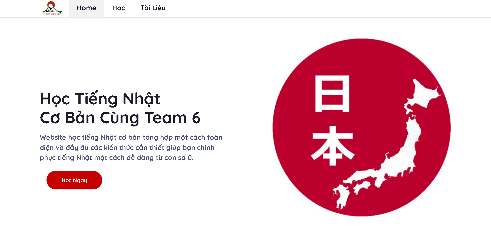

# Learning Japanese with Team 6 JS CLUB
Essential Japanese language learning website comprehensively and thoroughly synthesizes the necessary knowledge to help you level up your Japanese skills.

 
# Requirements
•	Node.js 14

•	Express.js

•	Cloud Firestore

•	EJS

# Config
•	Create file '.env' and fill in all information needed. 

•	You can change service account in `config.js`

# Run
•	Install packages

•	Open `http://localhost:7777` in your browser to access web app.

